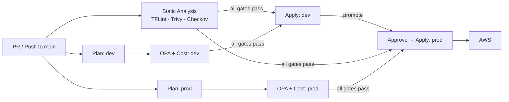
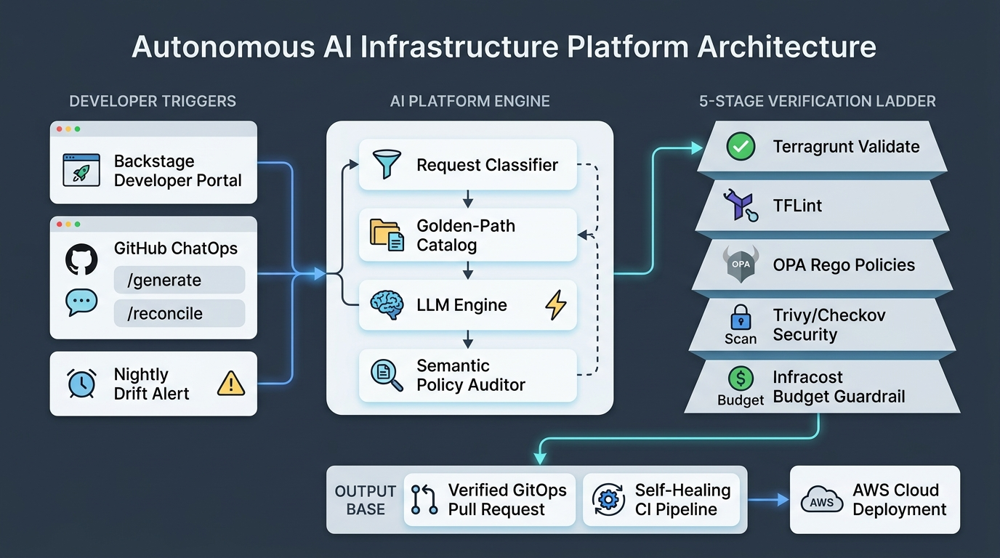

# Enterprise AWS Infrastructure

[](https://terragrunt.gruntwork.io/)
[](https://www.terraform.io/)
[](https://www.openpolicyagent.org/)
[](https://github.com/aquasecurity/trivy)
[](https://www.infracost.io/)
[](LICENSE)

A production-grade, multi-environment AWS platform built with **Terragrunt + Terraform** — fully DRY, policy-governed, and shipped through a self-healing GitHub Actions pipeline. Built to demonstrate senior/Staff-level Infrastructure-as-Code patterns end to end.

> **Deploy → validate → tear down.** This platform was deployed to a real AWS account and validated through the full pipeline, then scaled to zero (prod runs at `desired_size = 0`) and torn down via the automated `destroy` workflow to control cost. The FinOps controls below are part of *why* that's cheap and safe to do.

---

## Why this repo is worth a look

| Capability | How it's done |
| :--- | :--- |
| **100% DRY multi-env config** | Hierarchical Terragrunt blueprint — `root.hcl` generates provider + backend; `_envcommon/` holds shared module inputs; leaf files are ~10 lines. |
| **Policy-as-code governance** | OPA/Rego gates run on the **Terraform plan JSON** — mandatory tagging, no legacy instance families. Unit-tested with `conftest verify`. |
| **Multi-layer security scanning** | TFLint · Trivy · Checkov as blocking CI gates, plus module-level hardening (KMS, deny-all NACLs, Flow Logs). |
| **Zero-key auth** | GitHub Actions OIDC assumes short-lived IAM roles. No static AWS credentials exist anywhere. |
| **Self-healing CI** | On pipeline failure an agent pulls the failed logs, auto-upgrades provider locks or generates a fix diff, and pushes it to the PR branch. |
| **Cost governance** | Infracost posts a per-module cost breakdown on every PR; spot + scale-to-zero keep non-prod near $0. |
| **Nightly drift detection** | Matrix job compares live AWS vs. state and self-manages one GitHub Issue per environment. |
| **Zero-touch deps** | Renovate tracks Terraform modules, toolchain binaries, and GitHub Actions with grouped PRs. |

---

## Architecture at a glance

Strict separation of a generic **blueprint library** (`infrastructure-modules/`) from **live environment config** (`infrastructure-live/`), keeping configuration fully DRY. A single leaf module inherits everything from the layers above it.

```text
infrastructure-modules/     # Reusable Terraform (hardened VPC, EKS)
infrastructure-live/        # Terragrunt config per env/region
├── root.hcl                #   generates provider.tf + backend.tf, injects default_tags
├── _envcommon/             #   shared module inputs + cross-module wiring
└── <env>/<region>/<cat>/<module>/terragrunt.hcl   # ~10-line leaf: includes + overrides
infrastructure-bootstrap/   # Day-0 CloudFormation: S3 state bucket, OIDC provider, CI plan/apply roles
policies/terraform/         # OPA/Rego governance rules (+ unit tests)
.agents/                    # Self-healing CI agent
.github/                    # Workflows, composite actions, toolchain image
```

See **[docs/ARCHITECTURE.md](docs/ARCHITECTURE.md)** for the full inheritance model.

---

## CI/CD Pipeline



Parallel governance gates, sequential environment promotion, and a protected GitHub Environment requiring **manual approval** before any prod apply. Full detail in **[docs/CICD.md](docs/CICD.md)**.

---

## Autonomous AI IaC Platform & SRE Agent

This repository features a fully autonomous Platform Engineering agent that converts natural-language requests and nightly drift alerts into compliant Terragrunt modules.



### Key Capabilities:
- **Golden-Path First (Deterministic & $0 Cost):** Standard modules (encrypted S3, RDS PostgreSQL, DynamoDB) match pre-vetted templates with **zero LLM tokens and zero hallucination risk**. Uncatalogued requests route to the LLM scaffolding engine.
- **Semantic Second-Opinion Gate:** Every generated diff passes an independent review by the Policy Auditor persona before validation.
- **5-Stage Verification Ladder:** Every proposal must pass offline `-backend=false` init, TFLint, Conftest/OPA Rego rules, Trivy/Checkov security scans, and Infracost FinOps budgets.
- **Closed-Loop Drift Healing:** Responds to `/reconcile` issue comments to reverse-engineer AWS drift into an exact GitOps pull request.
- **SRE Error-Budget Guardrails:** Automatically freezes production proposals if the environment error budget is below 10%.

See **[docs/IAC_PLATFORM_AGENT.md](docs/IAC_PLATFORM_AGENT.md)** for complete end-to-end setup, Backstage IDP templates, and CLI guides.

---

## Self-Healing CI

When the main pipeline fails, a dedicated workflow (`pipeline_healer.yml`) triggers an agent (`.agents/scripts/healer_runner.py`) that:

1. Downloads logs for the **failed jobs only** (GitHub Jobs API) to stay within LLM token limits.
2. Detects common classes of failure — e.g. a Terraform **provider-lock mismatch** — and fixes them deterministically by running `init -upgrade` across all lock files, then commits the result.
3. For other failures, sends the logs + repo tree to an LLM, extracts a `git diff`, applies it, and pushes the remediation commit to the PR branch.

This turns a red pipeline into an auto-generated fix proposal instead of a manual investigation.

---

## Quickstart

```bash
# Prereqs: terraform >=1.15, terragrunt >=1.0.3, tflint, trivy, conftest, aws-cli v2
git clone https://github.com/ok-karthik/enterprise-aws-infrastructure.git
cd enterprise-aws-infrastructure

make install        # install the pre-commit hook (fmt + smoke-test + trivy)
make validate       # full local validation suite (compliance, fmt, init/validate, tflint)
make test           # run the OPA policy unit tests
```

Run `make help` for the full command surface. Plan a single environment with `make plan ENV=dev`.

**Day-0 bootstrap** (first-time only, CloudFormation stack `platform-bootstrap`) provisions the S3 state bucket, the OIDC provider and the two CI roles (plan / apply) — see [infrastructure-bootstrap/README.md](infrastructure-bootstrap/README.md).

---

## Security & governance highlights

- **Policy gates on plan JSON** (not just HCL): mandatory tags (incl. `Owner` / `DataClassification`), no legacy instance families, no admin-policy attachments outside the CI apply / break-glass roles, no public S3, no internet ingress on sensitive ports, no `*`/`*` IAM policies, encryption at rest — see `policies/terraform/`, unit-tested via `conftest verify`.
- **Least-privilege CI**: a read-only plan role for PRs and drift detection, and a separate apply role only the `dev` / `prod` GitHub Environments can assume (permissions-boundary capped). Stacks refuse to run in any AWS account other than the one in `account.hcl`.
- **Module hardening**: VPC ships a deny-all default NACL, a black-hole default SG, and Flow Logs → CloudWatch; EKS encrypts secrets with a dedicated KMS key and enables full control-plane logging.
- **State backend**: S3 versioning (point-in-time rollback), native S3 lock files (`use_lockfile`), block-public-access, TLS 1.2+ only, SSE at rest. The bucket is created by the Day-0 CloudFormation stack, not by Terragrunt.

Full tagging/IAM policy in [GOVERNANCE.md](GOVERNANCE.md).

---

## Documentation

| Doc | What's inside |
| :--- | :--- |
| [docs/ARCHITECTURE.md](docs/ARCHITECTURE.md) | Terragrunt inheritance model, module layout, state design |
| [docs/CICD.md](docs/CICD.md) | Pipeline stages, governance gates, drift detection, self-healing CI |
| [docs/IAC_PLATFORM_AGENT.md](docs/IAC_PLATFORM_AGENT.md) | Autonomous IaC Platform Agent visual flow, ChatOps, IDP & setup guide |
| [GOVERNANCE.md](GOVERNANCE.md) | Tagging policy, IAM, branch protection |
| [FINOPS.md](FINOPS.md) | Cost strategy: spot, scale-to-zero, teardown |
| [DISASTER_RECOVERY.md](DISASTER_RECOVERY.md) | Runbooks for state corruption, locks, partial applies |

---

## Tech stack

Terragrunt · Terraform · GitHub Actions · OPA/Conftest · Infracost · Trivy · Checkov · TFLint · Renovate · AWS EKS · AWS VPC · Docker (toolchain image)

## License

Apache 2.0 — see [LICENSE](LICENSE).
