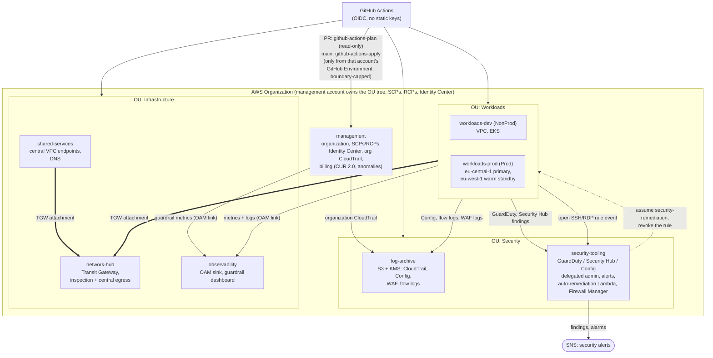
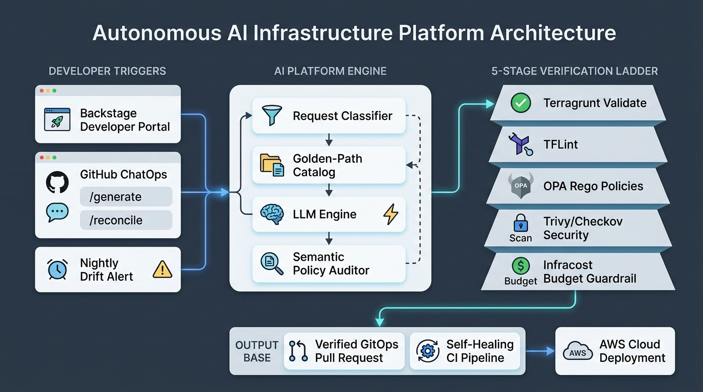

# Enterprise AWS Infrastructure

[](https://terragrunt.gruntwork.io/)
[](https://www.terraform.io/)
[](https://www.openpolicyagent.org/)
[](https://www.checkov.io/)
[](https://www.infracost.io/)
[](LICENSE)

A **multi-account AWS foundation** (landing zone) written as code with **Terragrunt + Terraform**: an Organization with
OUs and guardrails, an account per job, least-privilege CI with no static keys, central security and logging, a hub
and spoke network, edge protection, a second region for disaster recovery, and cost and observability across accounts.
Every change goes through policy, security and cost gates in a GitHub Actions pipeline.

It is the platform layer under [`internal-developer-platform`](https://github.com/ok-karthik/internal-developer-platform),
which builds the in-cluster and tenant side on top of the accounts, roles and discovery parameters made here.

## The design in one picture


```mermaid
flowchart TB
    GH["GitHub Actions<br/>(OIDC, no static keys)"]

    subgraph ORG["AWS Organization (management account owns the OU tree, SCPs, RCPs, Identity Center)"]
        direction TB
        MGMT["management<br/>organization, SCPs/RCPs,<br/>Identity Center, org CloudTrail,<br/>billing (CUR 2.0, anomalies)"]

        subgraph SEC["OU: Security"]
            LOGA["log-archive<br/>S3 + KMS: CloudTrail, Config,<br/>WAF, flow logs"]
            SECT["security-tooling<br/>GuardDuty / Security Hub / Config<br/>delegated admin, alerts,<br/>auto-remediation Lambda, Firewall Manager"]
        end

        subgraph INF["OU: Infrastructure"]
            NET["network-hub<br/>Transit Gateway,<br/>inspection + central egress"]
            SHR["shared-services<br/>central VPC endpoints,<br/>DNS"]
            OBS["observability<br/>OAM sink, guardrail dashboard"]
        end

        subgraph WL["OU: Workloads"]
            DEV["workloads-dev (NonProd)<br/>VPC, EKS"]
            PRD["workloads-prod (Prod)<br/>eu-central-1 primary,<br/>eu-west-1 warm standby"]
        end
    end

    GH -- "PR: github-actions-plan (read-only)<br/>main: github-actions-apply<br/>(only from that account's<br/>GitHub Environment, boundary-capped)" --> MGMT
    GH --> SEC
    GH --> INF
    GH --> WL

    MGMT -- "organization CloudTrail" --> LOGA
    SECT -- "findings, alarms" --> ALERT(["SNS: security alerts"])
    WL -- "Config, flow logs, WAF logs" --> LOGA
    WL -- "GuardDuty, Security Hub findings" --> SECT
    WL -- "open SSH/RDP rule event" --> SECT
    SECT -. "assume security-remediation,<br/>revoke the rule" .-> WL
    WL == "TGW attachment" ==> NET
    SHR == "TGW attachment" ==> NET
    WL -- "metrics + logs (OAM link)" --> OBS
    MGMT -- "guardrail metrics (OAM link)" --> OBS
```

More detail, and how to read it: **[docs/ARCHITECTURE.md](docs/ARCHITECTURE.md)**.

## What is real, and what is not

Read this before the rest. It is the honest part.

| | Status |
| :--- | :--- |
| **Code and offline tests** | Written and tested without AWS: about 40 Terraform modules with `terraform test` (mock provider), Rego rules with `conftest verify`, Python tests for the scripts and the agent, `terragrunt render` on the live leaves, CloudFormation lint. |
| **The new multi-account organization** | **Not applied.** Account IDs in `foundation-live-repo/_config/accounts.hcl` are placeholders (`TODO(owner)`) except the management account. The first real plan in CI (PLAN 2.11) has not happened. What was applied, if anything, is only in [docs/EXECUTION_LOG.md](docs/EXECUTION_LOG.md). |
| **The older single-account version** | This is what the "deployed to a real AWS account, validated through the pipeline, then torn down" story was about: a single account with `dev` and `prod` stacks, since replaced by the layout above. |
| **Measured numbers** | None yet: no RTO/RPO, no cost of the foundation, no SLO values. They have places to go (`DISASTER_RECOVERY.md`, `FINOPS.md`, `docs/SLO.md`) and a weekly job that computes the SLOs from GitHub history. |
| **Not written yet** | The compliance mapping (`docs/COMPLIANCE.md`, PLAN 4.7), most ADRs (only one exists), the failure-drill postmortems. |

The plan, in order, with what is done and not: **[PLAN.md](PLAN.md)**.

## What is in it

| Area | What the code does |
| :--- | :--- |
| **Organization and guardrails** | Organizations with OUs; SCPs (region allow-list, no IAM users, protect platform roles), RCPs (data perimeter), tag policy; Policy-Staging OU to test a guardrail before it widens. |
| **Accounts** | A registry (`_config/accounts.hcl`) is the single source of truth; an account factory vends accounts; every account gets a Day-0 CloudFormation stack (state bucket, OIDC provider, plan and apply roles) through StackSets. |
| **Identity** | IAM Identity Center permission sets, a break-glass role with alerts, no long-lived admin. |
| **Security baseline** | Organization CloudTrail to a log-archive account, GuardDuty / Security Hub / Config with a delegated admin, EventBridge auto-remediation (open SSH/RDP closed in seconds), Firewall Manager WAF policies, Shield Advanced (optional). |
| **Network** | Transit Gateway hub, central egress with Network Firewall (optional), shared VPC endpoints, DNS, IPAM. |
| **Resilience** | Second-region warm standby, state replication, Aurora Global Database, S3 replication, AWS Backup copies, Route 53 failover. Runbook in [DISASTER_RECOVERY.md](DISASTER_RECOVERY.md). |
| **Observability and cost** | Cross-account CloudWatch (OAM), guardrail alarms, CUR 2.0 export, cost anomaly monitors, per-account budgets, delivery metrics and SLOs ([docs/SLO.md](docs/SLO.md)). |

### Security controls

- **Zero-key auth**: GitHub OIDC to short-lived roles. `github-actions-plan` is read-only (PRs, drift); `github-actions-apply` can only be assumed from that account's GitHub Environment and is capped by a permissions boundary. Stacks refuse to run in any account other than the one in `account.hcl`.
- **Policy as code**: Checkov (general AWS security, on the HCL and on every plan), Rego for this organisation's own rules (tags, admin attachments, datastore ports, IAM wildcards), listed in one catalog: [policy-library-repo/POLICIES.md](policy-library-repo/POLICIES.md). Every gate blocks. Trivy scans the toolbox image only.
- **Apply what was reviewed**: the apply job on main applies the saved plan of the same run after a checksum check; it never plans again.
- **State**: S3 with versioning, native lock files, TLS-only, replicated to the second region.
- Tagging, IAM and branch protection policy: [GOVERNANCE.md](GOVERNANCE.md). (The compliance control mapping is not written yet.)

## Repository layout

A directory ending in `-repo` would be a separate Git repository in a real company ([ADR 0001](docs/adr/0001-repository-topology.md)).

```text
iac-modules-repo/           # Reusable, versioned Terraform modules (one release tag per module)
foundation-live-repo/       # The landing zone: management, security, infrastructure accounts
├── _config/                #   accounts, organization and regions registries
├── _bootstrap/             #   Day-0 CloudFormation: state bucket, OIDC provider, CI roles
└── <ou>/<account>/<region|_global>/<category>/<module>/terragrunt.hcl
workloads-live-repo/        # Platform stacks in workload accounts
└── workloads/<nonprod|prod>/<account>/<region>/<category>/<module>/terragrunt.hcl
policy-library-repo/        # Rego rules (+ tests) and the policy catalog
.agents/                    # IaC agent, self-healing CI, delivery metrics
.github/                    # Workflows, composite actions, toolbox image
docs/                       # Architecture, CI/CD, SLOs, runbooks, ADRs, execution log
```

## CI/CD

Per account, in parallel: static analysis, plan (only the affected units on a PR), then policy, security and cost gates.
On main, accounts are applied one at a time (management, core, dev, staging, prod) from the saved plans, with manual
approval on prod. Nightly drift detection opens one issue per account and region. Details: **[docs/CICD.md](docs/CICD.md)**.

## Quickstart

```bash
# Prereqs: terraform >=1.15, terragrunt >=1.0.3, tflint, checkov, conftest, aws-cli v2
git clone https://github.com/ok-karthik/enterprise-aws-infrastructure.git
cd enterprise-aws-infrastructure

make install        # install the pre-commit hook (fmt + checkov)
make validate       # full local validation suite (compliance, fmt, init/validate, tflint)
make test           # policy, module and script unit tests (no AWS credentials)
make checkov        # the same Checkov result as CI
```

`make help` lists everything. Nothing in this repo needs AWS credentials to be tested. **Applying is a human step**
(see [PLAN.md](PLAN.md), rule 4). Day-0 bootstrap: [foundation-live-repo/_bootstrap/README.md](foundation-live-repo/_bootstrap/README.md).

---

## Autonomous IaC agent and self-healing CI

Built on top of the foundation, and separate from it. The agent turns requests and drift alerts into Terragrunt changes,
and a healer proposes fixes for failed pipelines. Today every agent is at "propose" or "validate" level: none applies
anything.



- **Golden path first:** standard modules (encrypted S3, RDS PostgreSQL, DynamoDB) come from vetted templates with no LLM call.
- **Second opinion:** every generated diff is reviewed by an auditor persona before validation.
- **Verification ladder:** offline init, TFLint, Conftest/Rego, Checkov and an Infracost budget must pass.
- **Drift to pull request:** `/reconcile` on a drift issue proposes a corrective PR.
- **Error-budget guardrail:** prod proposals freeze when the measured error budget is below 10% ([docs/SLO.md](docs/SLO.md)).
- **Self-healing CI:** `pipeline_healer.yml` reads the failed jobs' logs, fixes provider-lock mismatches deterministically and otherwise proposes a diff.

Guide: **[docs/IAC_PLATFORM_AGENT.md](docs/IAC_PLATFORM_AGENT.md)**.

---

## Documentation

| Doc | What's inside |
| :--- | :--- |
| [PLAN.md](PLAN.md) / [docs/EXECUTION_LOG.md](docs/EXECUTION_LOG.md) | The roadmap and the dated record of what was done and checked |
| [docs/ARCHITECTURE.md](docs/ARCHITECTURE.md) | The picture, the Terragrunt inheritance model, state design |
| [docs/CICD.md](docs/CICD.md) | Pipeline stages, gates, drift detection |
| [docs/SLO.md](docs/SLO.md) | Platform SLOs, error budget, how the agent gate uses them |
| [DISASTER_RECOVERY.md](DISASTER_RECOVERY.md) | State loss, regional failover, RTO/RPO targets, game day |
| [FINOPS.md](FINOPS.md) | Cost model, per-feature cost, what to measure |
| [GOVERNANCE.md](GOVERNANCE.md) | Tagging, IAM, branch protection, gate ownership |
| [policy-library-repo/POLICIES.md](policy-library-repo/POLICIES.md) | Every enforced rule and who owns it |
| [docs/runbooks/](docs/runbooks/) | Blue-green for infrastructure, auto-remediation |

## Tech stack

Terragrunt · Terraform · CloudFormation (Day-0) · GitHub Actions · OPA/Conftest · Checkov · TFLint · Infracost · Trivy (image scan) · Renovate · AWS Organizations, IAM Identity Center, VPC, Transit Gateway, EKS

## License

Apache 2.0, see [LICENSE](LICENSE).
