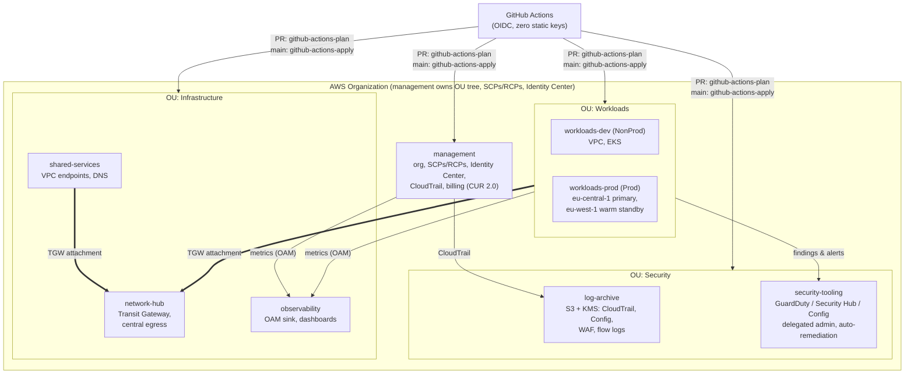

# Enterprise AWS Infrastructure

[](https://terragrunt.gruntwork.io/)
[](https://www.terraform.io/)
[](https://www.checkov.io/)
[](https://www.openpolicyagent.org/)

A multi-account AWS foundation (landing zone) built with Terragrunt + Terraform, featuring least-privilege zero-key OIDC pipelines, centralized logging, and strict policy enforcement across Organizational Units. Every infrastructure change evaluates against Checkov, OPA/Rego, and Infracost gates before manual approval promotes code into production environments. This repository provides the underlying cloud foundation, identity boundaries, and SSM discovery parameters consumed by the [`internal-developer-platform`](https://github.com/ok-karthik/internal-developer-platform).

## Architecture

> 🌐 **Interactive Diagram**: Explore the full system with live animation flows on **[GitHub Pages Architecture Visualizer](https://ok-karthik.github.io/enterprise-aws-infrastructure/)** or read **[docs/ARCHITECTURE.md](docs/ARCHITECTURE.md)**.


```mermaid
flowchart TB
    GH["GitHub Actions<br/>(OIDC, zero static keys)"]

    subgraph ORG["AWS Organization (management owns OU tree, SCPs/RCPs, Identity Center)"]
        direction TB
        MGMT["management<br/>org, SCPs/RCPs, Identity Center,<br/>CloudTrail, billing (CUR 2.0)"]

        subgraph SEC["OU: Security"]
            LOGA["log-archive<br/>S3 + KMS: CloudTrail, Config,<br/>WAF, flow logs"]
            SECT["security-tooling<br/>GuardDuty / Security Hub / Config<br/>delegated admin, auto-remediation"]
        end

        subgraph INF["OU: Infrastructure"]
            NET["network-hub<br/>Transit Gateway,<br/>central egress"]
            SHR["shared-services<br/>VPC endpoints, DNS"]
            OBS["observability<br/>OAM sink, dashboards"]
        end

        subgraph WL["OU: Workloads"]
            DEV["workloads-dev (NonProd)<br/>VPC, EKS"]
            PRD["workloads-prod (Prod)<br/>eu-central-1 primary,<br/>eu-west-1 warm standby"]
        end
    end

    GH -- "PR: github-actions-plan<br/>main: github-actions-apply" --> MGMT & SEC & INF & WL
    MGMT -- "CloudTrail" --> LOGA
    WL -- "findings & alerts" --> SECT
    WL == "TGW attachment" ==> NET
    SHR == "TGW attachment" ==> NET
    WL & MGMT -- "metrics (OAM)" --> OBS
```

## What is real, and what is not

| Area | Status |
|---|---|
| **Code & offline tests** | 41 Terraform modules tested offline (`terraform test` with mock providers), Rego policies (`conftest verify`), and unit tests for Python agents and scripts. Status breakdowns: [iac-modules-repo/README.md](iac-modules-repo/README.md) (28 📝 plan-only, 13 📐 design-only). |
| **Landing zone & live stacks** | Detailed status per account/region in [foundation-live-repo/README.md](foundation-live-repo/README.md) and [workloads-live-repo/README.md](workloads-live-repo/README.md). Placeholder account IDs in `accounts.hcl` keep CI safe until accounts are linked. |
| **Measured numbers** | Operational metrics (RTO/RPO, foundation costs, SLOs) are architectural models documented in [docs/DISASTER_RECOVERY.md](docs/DISASTER_RECOVERY.md), [docs/FINOPS.md](docs/FINOPS.md), and [docs/SLO.md](docs/SLO.md). |

## Applied, with proof

| Component | Target Account | Evidence & Proof | Verified Date | Notes |
|---|---|---|---|---|
| *Day-0 Bootstrap* | `management` | CloudFormation Stack Output | 2026-10-01 | State bucket, OIDC provider, CI roles created |
| *Foundational Stacks* | *Sandbox* | *Pending live apply in S5* | *Pending* | Tracked via module status tables |

## Key Design Decisions

- **Terraform-native Organizations & Day-0 StackSets** over Control Tower / AFT to ensure fast, deterministic, version-controlled account vending without recurring licensing overhead ([ADR 0002](docs/adr/0002-terraform-native-organizations.md), [ADR 0003](docs/adr/0003-state-architecture-and-day-0.md)).
- **Zero standing administrator access** via IAM Identity Center external IdP federation, ABAC session tags, and short-lived break-glass workflows ([ADR 0004](docs/adr/0004-identity-center-jit-access.md), [docs/IDENTITY.md](docs/IDENTITY.md)).
- **Multi-account Transit Gateway hub-and-spoke networking** with dedicated inspection routing and optional central Network Firewall egress ([ADR 0006](docs/adr/0006-transit-gateway-network-topology.md), [ADR 0007](docs/adr/0007-central-egress-network-firewall.md)).

## Repository Layout

A directory ending in `-repo` is treated as a separate repository in production ([ADR 0001](docs/adr/0001-repository-topology.md)):

- `iac-modules-repo/`: Reusable, versioned Terraform modules published independently via semantic release tags.
- `foundation-live-repo/`: Landing zone live stacks (management, security, infrastructure OUs) and Day-0 bootstrap.
- `workloads-live-repo/`: Platform stacks for workload accounts (`workloads-dev`, `workloads-prod`).
- `policy-library-repo/`: Rego compliance rules evaluated with Conftest against Terraform plan JSON.
- `iac-agents-repo/`: Autonomous IaC Platform Agent, self-healing CI bot, golden paths, and delivery metrics.

## Running Checks

All checks run offline without requiring AWS credentials:

```bash
make validate    # Full local validation (formatting, compliance, init/validate, tflint)
make test        # Offline policy, module, and agent unit tests
make checkov     # CI-parity security scan (.checkov.yaml)
```

## Autonomous IaC Platform Agents

This platform includes an on-demand **IaC Platform Agent** for self-service module scaffolding, drift reconciliation, and change-risk governance, alongside an autonomous **Pipeline Healer** that remediates broken CI builds. See **[iac-agents-repo/README.md](iac-agents-repo/README.md)** for autonomy tiers, guardrails, and local execution guides.

## Documentation Index

- **Architecture & Inheritance**: [docs/ARCHITECTURE.md](docs/ARCHITECTURE.md)
- **CI/CD & Gate Enforcement**: [docs/CICD.md](docs/CICD.md)
- **Identity & Privileged Access**: [docs/IDENTITY.md](docs/IDENTITY.md)
- **Disaster Recovery & Failure Modes**: [docs/DISASTER_RECOVERY.md](docs/DISASTER_RECOVERY.md)
- **FinOps & Cost Strategy**: [docs/FINOPS.md](docs/FINOPS.md)
- **Governance & Policy Catalog**: [docs/GOVERNANCE.md](docs/GOVERNANCE.md), [policy-library-repo/POLICIES.md](policy-library-repo/POLICIES.md)
- **Runbooks & Failure Drills**: [docs/runbooks/](docs/runbooks/)

## License

Apache 2.0, see [LICENSE](LICENSE).
