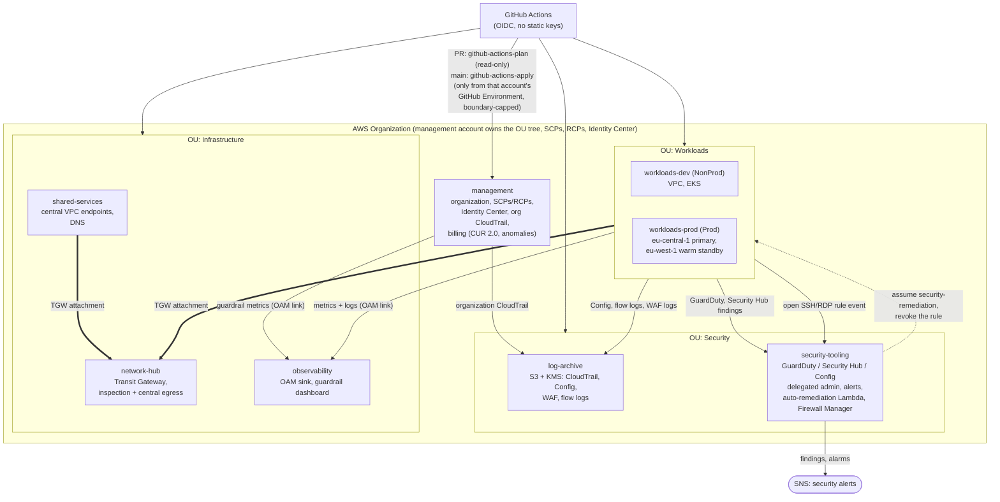

# Architecture

## The big picture (PLAN 10.2)

> [!TIP]
> **Interactive Visualizer & Diagrams**:
> - Open **[`docs/visualizer.html`](visualizer.html)** in any browser for the complete interactive multi-view architecture explorer with simulated workflow animations and node inspection.
> - Dedicated standalone diagrams:
>   - [🏢 Multi-Account AWS & Active-Passive DR](diagrams/multi_account_aws_infra.html)
>   - [🤖 AI Agentic Workflows Architecture](diagrams/ai_agentic_workflows.html)
>   - [🔄 3-Tier Feedback Loops & Quality Flywheel](diagrams/feedback_loops_quality_flywheel.html)
>   - [🔌 IDP Integration & Discovery Contract](diagrams/idp_integration.html)
>   - [🛡️ CI/CD Pipeline & Policy Gates](diagrams/ci_cd_policy_gates.html)

One AWS Organization, one OU tree, one account per job. Solid arrows are what the code in this repo builds. **Nothing
here is applied yet unless [`docs/EXECUTION_LOG.md`](EXECUTION_LOG.md) says so**: the diagram is the design the code and
its offline tests implement.

### Reading it

- **Identity chain.** GitHub proves who it is with an OIDC token. Each account has two roles made by the Day-0 stack:
  `github-actions-plan` (read-only, for PRs and drift detection) and `github-actions-apply` (only the account's GitHub
  Environment can assume it, capped by a permissions boundary). There is no role chaining and no static key.
- **Findings flow** to `security-tooling`; **logs flow** to `log-archive`; **metrics and logs for people** flow to
  `observability`. Nothing is copied by hand.
- **Network.** Spokes join the Transit Gateway in `network-hub`; internet egress can be local NAT per VPC or central
  (Network Firewall in the inspection VPC), chosen per VPC (`egress_mode`).
- **Second region.** `eu-west-1` holds a warm standby of prod; state is replicated to it and DNS failover is a module
  (`network/route53-failover`). See `DISASTER_RECOVERY.md`.
- **Not in the picture:** Sandbox, Policy-Staging and Suspended OUs (SCP test bed, throwaway accounts, closed accounts), and
  Firewall Manager policies applied to every account.

This platform follows a **Hierarchical Blueprint Pattern**: a generic, reusable Terraform library is kept strictly separate from live, per-environment configuration, so nothing is duplicated across environments.

## The two halves

- **`iac-modules-repo/`** — generic, reusable Terraform (`network/vpc`, `compute/eks`). Pure `.tf`, no environment specifics. Security hardening lives here, not just in CI.
- **`foundation-live-repo/`** and **`workloads-live-repo/`** — Terragrunt configuration that composes those modules: the landing zone (organization, bootstrap StackSets, Day-0 bootstrap) and the platform stacks per environment and region. They are split by who approves changes and how much damage a bad change can do, not by tool (see [ADR 0001](adr/0001-repository-topology.md)).

## The inheritance chain

To understand any live module you read it top-down through these layers — a leaf `terragrunt.hcl` is often ~10 lines because it inherits everything else:

1. **`root.hcl`** (one identical copy in each live repo, because separate repos cannot share a file) — included by every leaf. Generates `provider.tf` and `backend.tf` at runtime and injects `default_tags` (`Environment`, `Service`, `Project`, `ManagedBy`, `Account`). The S3 backend bucket name and tags are computed here — modules never hand-write provider/backend blocks.
2. **`_envcommon/<category>/<module>.hcl`** — the shared blueprint per module type. Sets `terraform.source` (into `iac-modules-repo/`), declares `dependency` blocks with `mock_outputs` for plan-time, and default `inputs`. Cross-module wiring (EKS → VPC subnets) lives here.
3. **Data files** loaded via `find_in_parent_folders`:
   - `<account>/account.hcl` — `aws_account_id` (the account the stack is *allowed* to run in), `account_name` (= the folder name), `ou`, `env` (`dev`/`staging`/`prod`/`global`), `owner`, `data_classification`. Must match this account's entry in `foundation-live-repo/_config/accounts.hcl`; `check-account-registry.sh` enforces it
   - `<account>/env.hcl` (one account = one env) — `env`, `cluster_name`, cost / resilience knobs (`min_size`, `desired_size`, `enable_nat_gateway`, `single_nat_gateway`) and `api_allowed_cidrs` (EKS public API allow-list; empty = private endpoint only)
   - `<account>/<region>/region.hcl` (or `<account>/_global/region.hcl`) — `aws_region`
4. **Leaf** `<account>/<region|_global>/<category>/<module>/terragrunt.hcl` — includes `root` + the matching `_envcommon` file and only overrides env-specific values (e.g. dev shrinks EKS node counts; prod runs `desired_size = 0`).

`path_relative_to_include()` drives naming everywhere — the state key and the `Service` tag — so **directory layout is a contract, not a convention**. The environment is **not** taken from the folder name: `root.hcl` reads `env` from `account.hcl` (one account = one env). Allowed envs are `dev`/`staging`/`prod`/`global`; regions must be in `foundation-live-repo/_config/regions.hcl` (both enforced by `workloads-live-repo/scripts/smoke-test.sh`). The provider has no `assume_role`: CI logs in over OIDC straight to the role of the one account it targets, humans use an SSO profile per account, and `allowed_account_ids` stays as the guard. Moving from the old `dev/`/`prod/` layout changed the state keys; see `workloads-live-repo/scripts/migrate-state-keys.sh` (dry run by default, owner only).

## Bootstrap (day-0)

`foundation-live-repo/_bootstrap/` is a CloudFormation stack (`platform-bootstrap`) that must exist before any live stack can deploy. It provisions the S3 state bucket, the GitHub OIDC identity provider, the `github-actions-apply` permissions boundary and the two CI roles (`github-actions-plan`, `github-actions-apply`) — i.e. the very backend and trust the live stacks depend on. CloudFormation is used here (not Terraform) because Terraform cannot create the bucket that holds its own state, and Terragrunt's `--backend-bootstrap` would create that bucket outside any state. `bootstrap.sh` refuses to run unless your credentials belong to the account in `foundation-live-repo/management/account.hcl`; member accounts get the same template through StackSets (PLAN 2.0b).

## State backend

Configured centrally in `root.hcl`: bucket `tg-state-<account-id>-<region>` per account/region, created by the bootstrap stack, with versioning (point-in-time rollback), native S3 lock files (`use_lockfile`, prevents concurrent-apply corruption), block-public-access, TLS 1.2+ only, and AES-256 SSE at rest.
